# Tedoku
[View the live project here](https://erikas-ramanauskas.github.io/Milestone-Project-2/)

Tedoku is a mix between tetris and sudoku with drag and drop functionality. Fill the vertical or horizontal lines as well as squares like sudoku but have them clear out to make more space or fill up board with gaps and lose the game like in tetris.

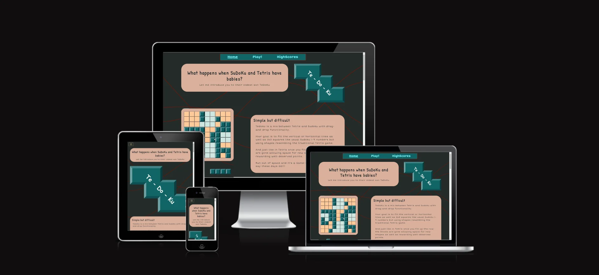

   

---
**Table of Contents**
* [Overview](#Overview)
* [User Experience](#User-Experience-(UX))
  * [First Time Visitor Goals](#First-Time-Visitor-Goals)
  * [Returning Visitor Goals](#Returning-Visitor-Goals)
  * [Frequent Visitor Goals](#Frequent-Visitor-Goals)
* [Design](#Design)
  * [Colour Scheme](#Colour-Scheme)
  * [Typography](#Typography)
  * [Imagery](#Imagery)
* [Wireframes](#Wireframes)
* [Features](#Features)
* [Technologies Used](#Technologies-Used)
  * [Languages Used](#Languages-Used)
  * [Frameworks, Libraries and Programmes Used](#Frameworks-Libraries-and-Programmes-Used)
* [Bugs and Solutions](#ugs-and-Solutions)
  * [Main chalange faced and decitions made](#Main-chalange-faced-and-decitions-made)
  * [Atempt-no-1](#Atempt-no-1)
  * [Atempt-no-2](#Atempt-no-2)
  * [Solved Bugs during developing](#Solved-Bugs-during-developing)
  * [Remaining Bugs](#Remaining-Bugs)
  * [Ideas for Future Developments](#Ideas-for-Future-Developments)
* [Game Idea and fuctions procces](#Game-Idea-and-fuctions-procces)
  * [Game board dimentions](#Game-board-dimentions)
  * [Shape creation](#Shape-creation)
  * [Drag and drop](#Drag-and-drop)
  * [Local storage](#Local-storage)
  * [Failure](#Failure)
* [Deployment & Local Development](#Deployment-&-Local-Development)
  * [Deployment](#Deployment)
  * [Local Development](#Local-Development)
  * [Making Local Clone](#Making-Local-Clone)
  * [Deployment](#Deployment)
* [Credits](#Credits)
  * [Mentor](#Mentor)
  * [Codes](#Codes)
* [Acknowledgements](#Acknowledgements)
* [Copyrights](#Copyrights)

---

## Overview
While the game concept is not new in a genre and my idea is not original it is taken from: [Tripledot Studios](https://apps.apple.com/us/developer/tripledot-studios/id1191319103) game: [Woodoku](https://apps.apple.com/us/app/woodoku-wood-block-puzzles/id1496354836) I chose this project as I enjoyed original game quite a lot as well as I believed it will be good programing chalange to pull it of. I was not mistaken.

The simplicity of the game is as as simple as as it gets, while I do provide rules to the visitor I strongly believe and as testing shows you dont need to truly know the rules or any specific language to pick up on the simplistic rules maching to the classic games as tetris, snake or pacman and just after a one or two game sesions player gets an idea how the game plays.

The beauty of such a simple games that no matter your age or language game can pickced up easily by anyone.

## User Experience (UX)
### First Time Visitor Goals
* As a First Time Visitor, I want to be able to immediately understand the main purpose of the application, "Tedoku".
* As a First Time Visitor, I want to be able to understand how to play the game.
* As a First Time Visitor, I want to be able to choose what dificulity of the game I would like.
* As a First Time Visitor, I want the pages to be responsive to be my device, no matter it's size.
* As a First Time Visitor, I want to be able to read a rules of the game.
### Returning Visitor Goals
* As a Returning Visitor, I want to be able to try my chance again at getting a higher score by being able to reload the game.
* As a Returning Visitor, I want to see highscores and statistics of the game.
* As a Returning Visitor, I want to be able to find details of dificulity levels.
* As a Returning Visitor, I want to be able to return to my previous game.
* As a Returning Visitor, I want to be able to see a developer details and links to his portfolio.
### Frequent Visitor Goals
* As a Frequent Visitor, I want to be able to give my feedback to the developer.
* As a Frequent Visitor, I want to be able to keep improving my game results and view in best scores and games played by mode.
* As a Frequent Visitor, I want to be able to see reach week a new result and top score to reach.

## Design
### Colour Scheme
- The main colours used on the site were taken from [Quick google search](https://visme.co/blog/website-color-schemes/) for most popular website colours. I chose no **16 Sleek and Futuristic** that provided me with dark background colour, green colour for tiles, creamy colours for game board. 

- Additional *Highlight* and *Destruction* colours or light blue and dark red were chosen using [Adobe colour wheal](https://color.adobe.com/create/color-wheel) to achive friendly blue and opposite red colours for the game. 

- Lastly I used [Google drawings](https://docs.google.com/drawings/d/1zYM5X07tbM9bjbcnPzPutqnbWnuPrkjqw5Jbvkt5qJ8/edit) That I am well familair with to create a cube shapes that automaticaly create maching off colours that I used on a boarders to create diamond-ish effect.

- Since I focused on developing game first I used same list of colours to design main and home page nicely mathcing the theme.

- Orriginaly I wanted a background to have few nice abstract brush strokes that would not take away from game desing or blur with important details. However I found [Bgjar](https://bgjar.com/curve-line) website creating simple background that I liked and used darkest colour from previously discovered ones as well as *Destroy* colour to create dinamicaly changing background.

### Typography
- At the begining and almost though out the development I used cursive font unintentionaly on chrome browser due to a bug that did not pick up my main starting font (if it works dont fix it?). However I later discovered it was a backup and on different browsers it looked horrible. So I decided to stick with "Short Stack" as main font for entire website and "Patrick Hand" for a headers. I wanted simple and relaxed font that has no sharp edges. As a game website I believe it should contain some part of goofiness.

### Imagery
- All images I have used were screenshots of the game or created by my self. Notably the [favicon](https://docs.google.com/drawings/d/1PV9lJTaGROsU-L2_aiweFqz9qzv0k4os83BYs8yg_UA/edit?usp=share_link), [Hero Immage](https://docs.google.com/drawings/d/1aUhTnydhPAQ-nGkEuJX4YXiUFeTYRWfOYv2e_tQ94YY/edit?usp=share_link) on main page and [turn](https://docs.google.com/drawings/d/1IrLDSAcdjnuRsUePY-pb7rymWmC1StTxvZYfM21RPsk/edit?usp=share_link) buttons were created using simple Google drawings. Some turned in to svg file

## Wireframes
- Desktop home page
- 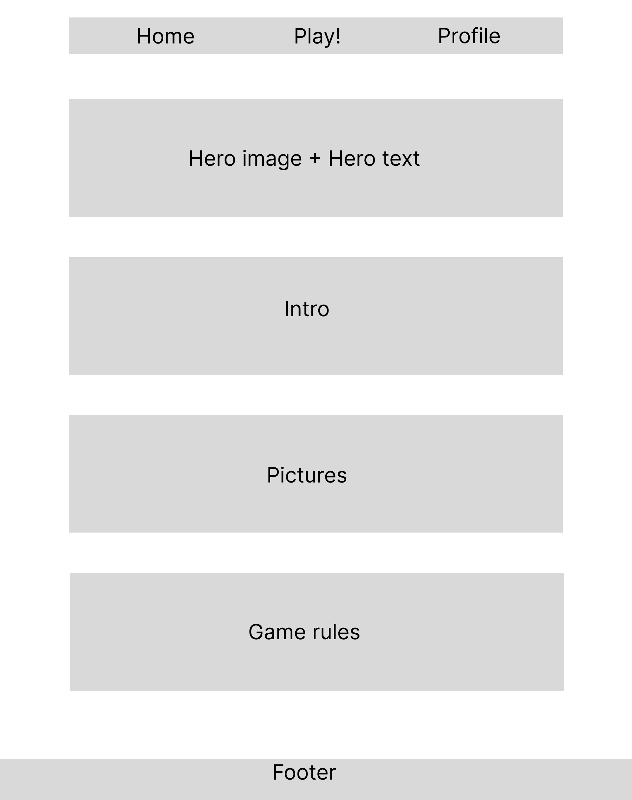
- Mobile home page
- 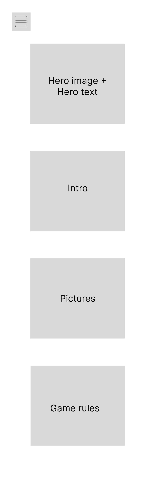
- Highscores page
- 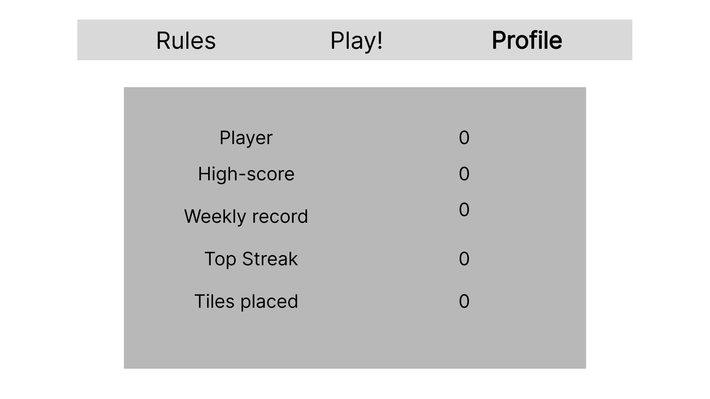
- Game page
- 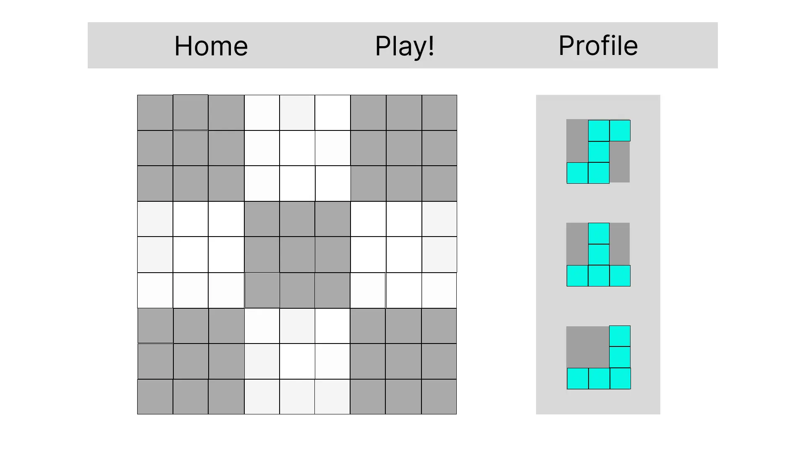
- Game page with gameplay
- 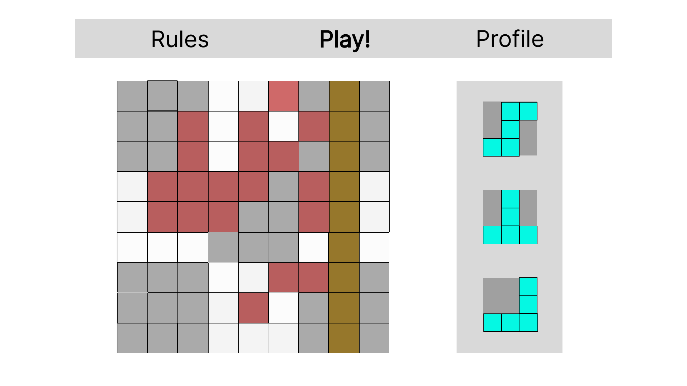
- Game board layout plan
- 
- Game board components
- 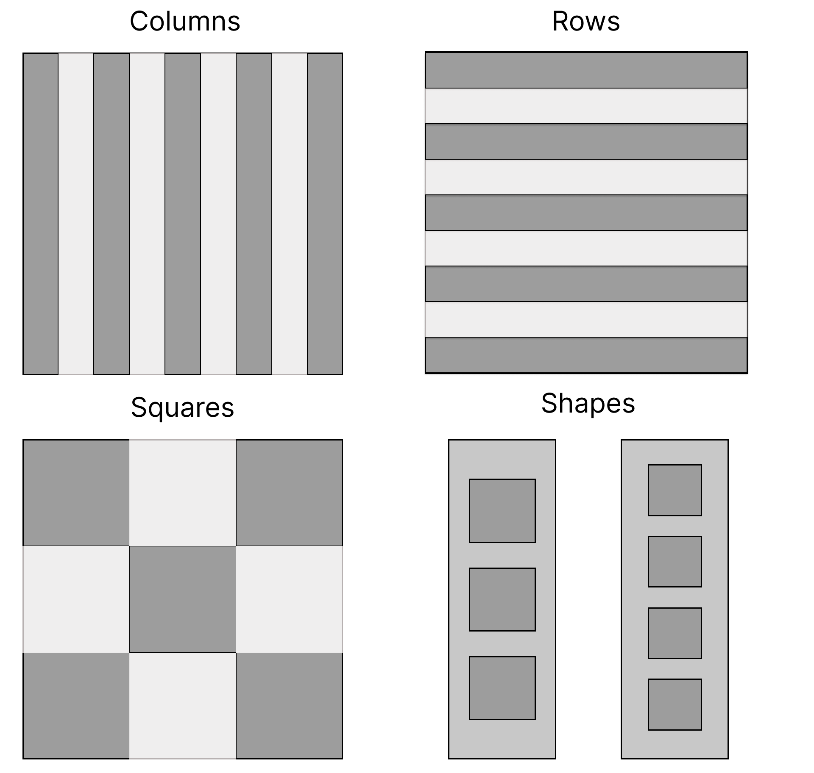
- Game buton layouts
- 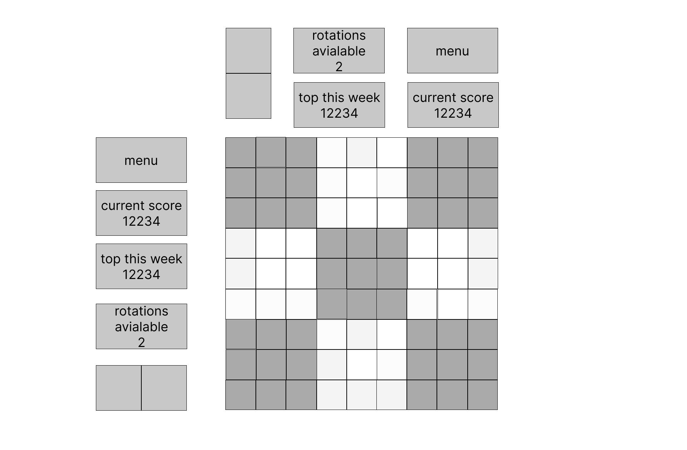
- Game phone landscape
- 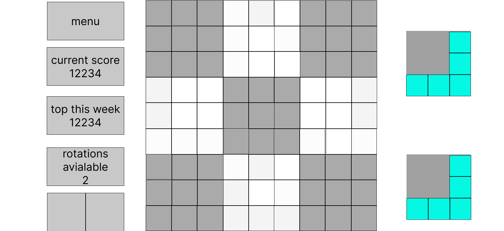
- Game phone portrait
- 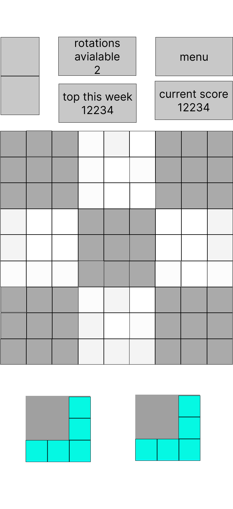

## Features

| # | Feature | Desirability | Importance | Viability | Delivered |
| :---: | :--- | :---: | :---: | :---: | :---: |
| | Navigation | | | | |
| --- | --- | --- | --- | --- | --- |
| 1 | Main page | 5 | 5 | 5 | ✅ |
| 2 | Game page | 5 | 5 | 5 | ✅ |
| 3 | Highscore page | 5 | 5 | 5 | ✅ |
| 4 | ""Play!"" button changing to ""Start new game!"" | 5 | 5 | 3 | ❌ |
| 5 | Game dificulities opens up as you press ""Play!"" or ""Start new game!"" | 5 | 3 | 4 | ✅ |
| 6 | Within profile page giving player a choice of the tiles style | 4 | 3 | 3 | ❌ |
| -- | --- | --- | --- | --- | --- |
| | Visuals | | | | |
| --- | --- | --- | --- | --- | --- |
| 7 | Game boad layout changing depending on height and width and determening wich one is bigger. | 5 | 5 | 5 | ✅ |
| 8 | Diferent styles for the tiles and the board | 4 | 3 | 3 | ✅ |
| 9 | Animations on destroying the tiles | 5 | 4 | 4 | ❌ |
| 10 | Animations on the score count once points achieved | 5 | 3 | 3 | ❌ |
| 11 | Flashier animation when combo points achieved | 5 | 3 | 3 | ❌ |
| 12 | Home page and hoghscores components apearing on scroll | 5 | 3 | 4 | ✅ |
| -- | --- | --- | --- | --- | --- |
| | Game feautures | | | | |
| --- | --- | --- | --- | --- | --- |
| 13 | Easy dificulity - ability to flip the shapes, chance to get extra shapes, guided highlight for match | 5 | 4 | 5 | ✅ |
| 14 | Medium dificulity- Same as easy but no ability to flip or extra shapes | 5 | 4 | 5 | ❌ |
| 15 | Hard dificulity- Same as mediuim but timed and no highlights | 5 | 4 | 5 | ❌ |
| 16 | Insane dificulity- same as hard, but with added 25% of filled tiles becomes invisiable. | 5 | 3 | 4 | ❌ |
| 17 | Point count 1x points for single break of 9 | 5 | 5 | 5 | ❌ |
| 18 | Point count for combo of more than 9 tiles, every extra combo adds 0.5x, Example destroying 2 row or collumn will multiply points by 1.5x. For 3 combo 2x | 5 | 5 | 4 | ❌ |
| 19 | Additional point multiplier Easy 1x, Medium 1.5x Hard 2x, Insane 3x | 5 | 4 | 4 | ❌ |
| 20 | ""Game over"" message | 5 | 5 | 5 | ✅ |
| 21 | Automatic detection of game over | 5 | 5 | 5 | ✅ |
| 22 | Ability to flip tiles | 5 | 4 | 4 | ✅ |
| 23 | Upon reaching certain score Unlocking ""Insane"" dificulity | 3 | 3 | 3 | ❌ |
| -- | --- | --- | --- | --- | --- |
| | Redesigned Game feutures | | | | |
| --- | --- | --- | --- | --- | --- |
| 24 | Shape turns have limited uses | 5 | 5 | 5 | ✅ |
| 25 | Shape turns are rewarded for combinations | 5 | 5 | 5 | ✅ |
| 26 | Each dificulity has less starting turn points | 5 | 5 | 5 | ✅ |
| 27 | Each dificulity requires more combination points to reward | 5 | 5 | 5 | ✅ |
| 28 | Reward multiplier 50% for combinations for all dificulities | 5 | 5 | 5 | ✅ |
| 29 | Highlight of tiles when maching tiles found during drag | 5 | 5 | 5 | ✅ |
| 30 | Highlight of tiles when 9 matching tiles are found | 5 | 5 | 5 | ✅ |
| 31 | Additional 20% points for medium dificulity | 5 | 5 | 5 | ✅ |
| 32 | Additional 40% points for hard dificulity | 5 | 5 | 5 | ✅ |
| -- | --- | --- | --- | --- | --- |
| | Highscores | | | | |
| --- | --- | --- | --- | --- | --- |
| 33 | Player name that player can change for them self | 4 | 3 | 4 | ❌ |
| 34 | Top highscore overal showing highest score game type and score | 5 | 5 | 5 | ✅ |
| 35 | Top highscore weekley | 4 | 5 | 5 | ✅ |
| 36 | Top streek | 4 | 3 | 4 | ❌ |
| 37 | Tiles destroyed | 4 | 3 | 4 | ❌ |
| 38 | Individual top score for Easy game | 5 | 4 | 5 | ✅ |
| 39 | Individual top score for Medium game | 5 | 4 | 5 | ✅ |
| 40 | Individual top score for Hard game | 5 | 4 | 5 | ✅ |
| 41 | Individual top score for insane game | 5 | 4 | 2 | ❌ |
| 42 | Ability to share game results on social media | 5 | 3 | 2 | ❌ |
| 43 | Ability to see other top highscores between other players | 5 | 3 | 2 | ❌ |
| 44 | Ability to see top highscores between game modes | 5 | 3 | 2 | ❌ |
| 45 | Ability to see top highscores between top and week charts | 5 | 3 | 2 | ❌ |
| -- | --- | --- | --- | --- | --- |
| | Home page and tutorial | | | | |
| --- | --- | --- | --- | --- | --- |
| 46 | Video showcasing the gameplay | 4 | 3 | 4 | ❌ |
| 47 | Introduction to a game and points reward | 5 | 5 | 5 | ✅ |
| 48 | Explanation of individual level dificulities | 5 | 5 | 5 | ✅ |
| 49 | Footer with links to creator social media. | 5 | 5 | 5 | ✅ |


## Technologies Used
### Languages Used
* HTML5
* CSS
* JavaScript

### Frameworks, Libraries and Programmes Used
- [Google Fonts](https://fonts.google.com/) fonts used to import main fonts for the page.
- [Online-Convert](https://image.online-convert.com/) was used to convert the png images to webp.
- [BGjar](https://bgjar.com/curve-line) - For background generation.
- [Git](https://git-scm.com/) was used for version control.
- [Visual studio code](https://code.visualstudio.com/) was using most of the time when internet was not avialble.
- [GitPod](https://gitpod.io/) was used as online IDE for GitHub and the terminal was used to add and commit to Git and push to GitHub.
- [GitHub](https://github.com/) was and is being used as repository of the project source code and for deploying the site/ application.
- [Prined version](https://websitesetup.org/javascript-cheat-sheet/) of JS cheatsheet was used when internet was not avialable.
- [Favicon](https://favicon.io/favicon-converter/) was used to create favicon.
- [Figma](https://www.figma.com/) was used to create wireframes
- [Chrome DevTools](https://developer.chrome.com/docs/devtools/) was used to test the code and debug the code during the development process.
- [W3C Markup](https://validator.w3.org/) Validation was used to test HTML code
- [W3C CSS](https://jigsaw.w3.org/css-validator/) Validation Service was used to test CSS code
- [Jest](https://jestjs.io/) was used to test JavaScript code

- [Google sheets](https://drive.google.com/drive/u/0/folders/1_VxQCii04fFd1Zq0wxsbFM4VuxG_2guz) were used to create a small interactivle interface in order to create shapes for the game and turn them in to JavaScript Object for simple copy paste. It allowed me to experiment with diferent shapes without spending time manualy typing the code. [link](https://docs.google.com/spreadsheets/d/1rQbG19eHYj0ltU_YNrQAcVxWLgIqnsbVytKtXd3tatI/edit)


## Bugs and Solutions

### Main chalange faced and decitions made
Before going in to individual smaller bugs one issue and soliution requires its own separate topic: Drag and Drop **multiple** components.

*Note I had 2 attemps at solving the whole drag and drop functionality atempt no 1 was writen after I sorted it using mainly drag and drop event listeners for PC ounly, however when I started working on it again to set it up for touch functionality I reprogramed it to work with pointer event listeners instead that solved most if not all problems I had in first attempt*

#### Atempt no 1
 - Due to a nature of the game one of the requirements for the code is to create a shapes of multiple squares and have them interact with game board individualy. 
 - While drag and drop functionality was new for me (not in the course) I reasearched few vidoes but the one that was my main source of information was by [Traversy Media](https://www.youtube.com/watch?v=C22hQKE_32c&t=360s) with added info from [MDN database](https://developer.mozilla.org/en-US/docs/Web/API/HTML_Drag_and_Drop_API). I used this as my louchpad of drag and drop "playground" which after few trial and error was simple enough for single element. 
 - How ever problems started when I tried to do 2 things: Drag more than one element and scale element I am dragging.
 - [Drag and Drop API](https://developer.mozilla.org/en-US/docs/Web/API/HTML_Drag_and_Drop_API) has its onwn listener functions quite similar to mouse events and one of events drag over was my hope to be a triger for each of the shapes I am draging, however there was no posibility of draging multiple sibling elements.
 - One of the ways I tried was using *dispatchEvent()* function but it completley crashed browser due to events boucing between siblings.
 - Another idea sugested by a friend to attach the shapes to a mouse cursor using: *position:absolute* and width height properties. However at that moment I relised it is not needed, as it alow user to be flexible and click anywere he wants on the shape without having pices to snap around.
 - Another issue was to do with practicaly all *mouse* events not trigering during the drag and right after dragdrop. To my understadning all of mouse events are transfered to drag functions. I had to adopt a mix of both for the final result.
 - My soliution was to capture mouse position when it is clicked on one of the shapes. In turn I captured a parent div > and taken its children > recorded all X and Y cordinates and calculated center of each shape boxes. This way using *dragover* listener that gave me current mouse position, I was able to calculate all active boxes of the shape while draging their parent.
 - Additionaly I captured all game board dropboxes coordinates at the start of drag of all 4 of their edges and using simple conditional testing I was able to check when ever draggable box center enters the squares, and used same principal of functionality to place them in while I did not directly appended the children as in the video (that would coused parent div to go inside of one of boxes only)
 
 - Lastly the issue I had that once something is beign dragged it CAN NOT be modified via css.
 - This was important for me to do as my game board is 9x9 squares and on the side I wanted to fit 3 or even 4 game shapes that could be as big as 4x4. Taking that together it is 12 or even 16 squares each in the same space as game board *check early wireframes*. this means I had to make them smaller than game board sqaures and scale them up as the player pick them up. *That is how original game I got an idea from works*
 - I have been searching multiple ways to achieve this, via *scale*, changing width and height, transforming, creating element bigger and fitting in the smaller box yet the design of draggable "shadow element" did not change. 
 - On top of it any element that is parent of draggable element transfers background color to dragable element and no traditional css rule has changed that, causing the same "grandparent" colour to stay on invisible *inactive* squares and edges were border radius was present. The only element background color was not takign was "body".
 - Since I spend a large portion of time on these 2 problems and one of them was solved I decided to change a desing of the game and create shapes of the same size as the game board by fitting less of them or rearanging the layout as well as adding no backgroudn to parent divs.
 - this is something I would like to revisit in a future and build up my orriginal vision.
 
 
 #### Atempt no 2
 - Once I returned to drag and drop functionality weeks later to make it responsive on touch screens as well I researched videos about events that works with touch screens and stuck on [Web Dev Simplified](https://www.youtube.com/watch?v=MhUCYR9Tb9c) as my main reference. However drag events were still not working with touch.
 
 - I discovered [this video](https://www.youtube.com/watch?v=GU3lQTbwUZc&t=275s). The main idea was to atach anything I am tryign to drag to a mouse after the click with *position:absolute and left+right*. Same idea I have goten from friend Olegas (who is js/react developer) however I dismised it early on before. I used this idea this time to try to make pointer events being main caller for both touch and mouse events. And managed to figure out 90% of code idea my self.
 
 - The Brekathough hapened when I found this [article](https://javascript.info/mouse-drag-and-drop) That essentialy contained everything I have figured out up to that point and more to solve this puzzle. The final piece missing was this code that I took from article: 
 
````
 ball.ondragstart = function() {
 return false;
};
````
 
 - All of previous problems were solved essentialy with pointer video and this article makign game function on both touch and mouse events. As well as no longer bound to drag events allowing me to edit css if I wish so and removing weird bug that would not record shape centers and cousing shape to disapear uncontrolable.
 
 - if I have to work with drag and drop or I recomend anyone to do it [Web Dev Simplified](https://www.youtube.com/watch?v=MhUCYR9Tb9c) and [article](https://javascript.info/mouse-drag-and-drop) is ideal guide for this type of purpose.

### Solved Bugs during developing
 - There were a bug that coused the bigger shapes of 4 width or height to split up and take over 5 leaving 1 as a gap. this is due to js maths and resizing and causing the drop area being bigger than a shapes squares. When retrieving data of shapes X and Y I added to the top and left 1% (multiplied by 1.01) as well as divided right and bottom edges by the same. This seems to solve the problem, yet the player will have to more accurate on droping shapes than innitialy.
 
 - Several resizing issues were detected when changing direction in the phone mode, and especialy when resizing sreen size while testing in responsive mode. Main issue was that shapes and buttons mostly relied on game board dimentions. During resize event listener the order of functions were not in order and changing them around *gameBoardAndScreenDimentions();* first and *setShapesContainerSize();* after seem to solve the problem
 
 - Initialy I had event listeners added to a dragEnd listener *if* section which checks if shape was droped in the game board thus creating new shape and at the end adding new event listeners. However there is an existing bug that sometimes the droped shape does not apear on the game board and new shape is created insted but no event listeners are added to new shape making the shape unusable for the remaining of the game. Instead I created spearated function and called after *if* statement and to reset all event listeners every time drop down is perfomed. **Solved with atempt no 2 of drag and drop**
 
 - Home page design was relatively smooth apart a few lineup problems that were solved using bootrstap classes and mainly sticking with mb-5 and row/col classes. However one isue that at the 2 examples of combination the text was wraping diferenly since one had a longer text. This automaticaly pushed one of pictures lower than the previous one at certain sceen breakpoints. Simple soliution I found is to place invisible span text at 1400 px when the breaking of the text start so it would treat it as extra word and snap aditional rows together at the same breakpoints. How ever I would love to find out if the is simple css soliution to conect 2 elements and comand them to be same size.
 
 - Within game screen window I have added 2 buttons for rotation and used Font awesome icons. However a regular use of them complicated a size of them and on diffenrent screens they did not responded how I wanted. There were to many situations I had to work with to make them right. I decided to try out svg file instead but FA icons requires premium account. Eventualy I meved on to creating my own icons using simle google drawings that I am well familliar with and downloaded them as as svg file and used a code from it alowing me to customize them and add in property that worked for all screen sizes
 
 - Navigation bar responsivnes using botstrap nav-bar to be open when on smaller devices and not being able to close, I spend some time tryign to figured out why it was hapening untill I simpley deleted and started over from 0 with navigation bar when I realised I linked botstrap twice. Both of starting from scratch and deleting extra link solved an issues.
 
 - navigation bar bootstrap class sticky was not working either how I wanted so I used a JS code i knww from Udemy course.
 
 - **Moved from remainign bugs** There is a rare occouring bug that when the shape is droped in the game field sometimes it does not regiter but a new shape is created instead anyway. It hapens rarely and I am not sure why it hapens or how to create the bug manualy or how to solve it at the moment. **Solved with drag and drop atempt no 2**


### Remaining Bugs
 - Sometimes when draging one shape a second active game shape moves in to a place of active shape but moves right back once first shape is droped. This does not actualy effect the game play just a visual clutter
 
 - If screen size is changed after dragin a shape and placing it back the shape retains dimentions of original screen size. This is not a problem in most cases apart in practice it could be a problem with galaxy fold if player does this and opens or closes the phone.
 
 - Testing on phone model One Plus it seems the overflow-x: hidden; does not work and the screen can be dragged left and right a bit
 
 
### Ideas for Future Developments
* Future developments to improve on the existing game:
  - Return to original idea of having 3 shapes for the game as additional future. Expanding on this idea there could be an option to customise players gameplay with multiple shapes up to 4
  - Animation affects for placing shapes and destroying shapes
  - Reward system unlocking different "Skins" for the game board and background for example when player reaches certain amount of points, makes large combo of 6 or more, Gets destruction streak and many more could be added. Skins essentialy changes a colours of game board and game pieces.
  - Reward player with additional sounds to replace originals.
  - Highscores screen were you can see other players top 10 or even top 100 and compete every week.
  - Multiple functionalities changign the game play
    - Fliping shapes in mirror insted of rotating
    - Rewarding players for makign a streak instead of combination
    - Randomly deleting squares and creating other onces
    - Creatign random squares that rewards extra points or rotation points
    - Creatign random squares that blocks a destruction for x amount of moves
    - Creating new random shape set after shape is droped.
    - Giving a timer for the game and rewarding extra time every time destruction is done (like chess blitz)
    - Making player versus player game
  - All of ideas above could be combined in to a random ruleset given for players every week encouraging them to fight for best scores every week and creatign more replayibility.
    
## Game Idea and fuctions procces

### Game board dimentions

 - Since the game board is always square I had to account for a space from top and bottom for meniu buttons, score as well as shapes. I wanted to ensure that mobile users are able to play game either verticaly and horizontaly unlike the game I got the idea from. main function looks for the min between landscape and portrait and determines wich way the board and everything else needs to lay out.
 
 - Because the board is 9 squares I added 1/2 square distance as a boarder around making everythign else some sort of division by 10 and multiplication by X depending how I wanted everything to be layered.
 
 - One note on this that I would like to improve the code and instead create variables in javascript and do all the math instead on CSS. However this would require some time to investigate and figure out for me.
 
 - Game board squared for later use are called in columns rows and square classes durign redering with some math. This helps later to find wich columns rows or squares are fully filled.
 
 - Additionaly resize event listener changes the game board depening on the screen size as well as record all open game dropbox squares for later when pointerMove and pointerUp functions are called. This is to ensure fresh data is kept if window changed dimentions

### Shape creation
 - In order to create shapes I wanted first of all a tool to create them. I used my skills in google sheets to create [this](https://docs.google.com/spreadsheets/d/1rQbG19eHYj0ltU_YNrQAcVxWLgIqnsbVytKtXd3tatI/edit) spreadhseet that alows me to easily create shapes object with true/false values. It essentialy detects how far the shape goes (always starting shape from top left corner) and determines if it is 1x1, 2x2, 3x3, or 4x4 square. This is important to keep in the squares always as other functions manipulate it easier.
 
 - Once I got an array ready it is all about manipulating and selectg them. randomInt(min,max) function alowed me to get random number betwen 2 given digits. Using this I chose random number betwen 0-1000. I assing each shape dificulity a procentage in thousands Starting with Easy(910), medium(60) and hard(30). Then chose random number. If it rolls anywere between 0-910 it is easy shape, then if it rolls more than 910, else if statement then looks if it is not bigger than easy+medium (970) resulting in medium shape, then last else automaticaly allings with hard. Lastly since each shape dificulity contains ten I go with randomInt(0-9) and get random shape from list of 10. 
 
 - Then it comes given shape manipulation. There are 2 things. Miroring the shape, esentialy fliping verticaly and rotation. 2 functions created to handle that as per my plan I made in quick google drawing and simply rearanging the the order of the shape array. As for rotationg shapes the function does it clockwise but if done 3 times it is a same if done anticlockwise

 
  
 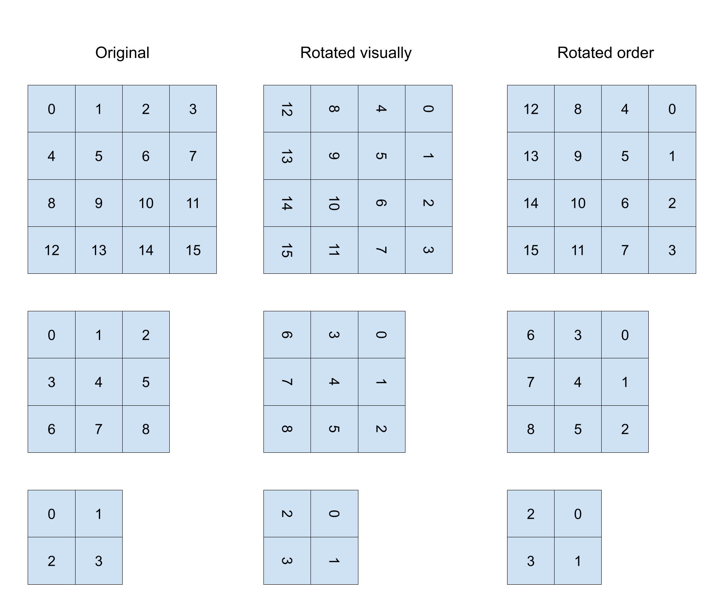
 
 - Finaly the array is rendered and added shape-window element and given a class of draggable * shape width that are prepared with different measurments to ensure shape always stays in the center.
 
 - For a new shapes to apear the functionality is implemented that the % of the easy/medium/hard shapes would be adjusted every turn. To ensure that it does nto get very dificult right away from my math knoweladge I knew if I make formula with power of **0<x<1** it will create [diminishing return](https://docs.google.com/spreadsheets/d/1i6MG8unq6J_bRvPEdR8JG7CDxI9pEpCv1-BizUnFuhA/edit#gid=0) starting with fast increcement and slowly adding less and less to a % of medium and hard shapes. It took a bit of gameplay between my friends to tune the nubers down but it can be easily adjusted again. I also added turn treshold to start trigering this formula in action to delay dificulity from the start and allowing player for window of oportunity at the beginign to build up some combos.
 
 ### Drag and drop
 
 - I mostly explained the isues and idea of drag and drop within bug section. However notibly 3 functions of pointerDown / ponterMove / pointerUp works along side each other to practicaly set everything off in the game that hapens.
 
 - pointerDown runs functions that once clicked on the shape it records active shapes centers in to object, as well as ads new static dimentions instead of % (this creates bug mentioned earlier) to the shape and finaly alowing the shape to be draged. 
 
 - pointerMove mostly works with checking shapesBoxesCoordinates versus dropBoxesCenters to find an equal match and once all squares find its partner the highlight class is given to mark dropable locations for the shapes and deleted every time pointer move event is called again so it ensures that highlight class is not left over. (As I wrote this I think this could be a good idea for painting program or game that you draw or contol with mouse movement)
 
 - Drag Center Concept
 - 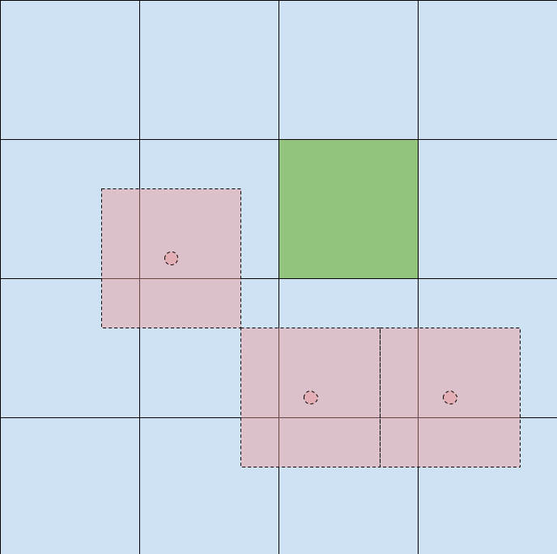
 
 - Additionaly highlightTiles() checks if player has matching squares of 9 or more and highlights in red that the shapes could be destroyed.
 
 - pointerUp is were the magic happens. Most of functionality is run right after player lifts mouse/finger and there are 2 ways: either drop shape in right place or not. It runs the same function as pointerMove checkign for avialabe squares 
 
 - In case the shape is droped in the wrong place the shape simply returns back and nothing hapens. However if the shape is droped in the game board multiple things hapens:
 
 - The game creates new shape insted using the proces I described before
 - The game checks if the shape is creating a 9 or more group using same highlightTiles() function and trigers destruction of the shapes (Esentialy changes classes)
 - The game also check for end game takeing both shapes array, creatign matrix out of it. Deleting uneceseraly rows and colums and then runign every posibility agaisnt game board via trigerGameOverCheck() function. This also includes creating aditional matrixes for each varition of ucrrent shapes in case the player has turns left essentialy detecting when player has no more moves.
 
 - In all of above procces 2 audios played, one for placing the shape and one for destroying squares.
 
 - Additionaly droped shapes also runs multiple functions calulationg points for current and top scores as well adding rotation points if player deserved them.
 
 ### Local storage
 
 - I wanted to ensure that the player is able to leave and return to the game when ever pleses and not forced to play entire game as high level and patience players may take much longer time. In order to do this I used local storage to be activated every time the shape is droped.
 
 - Local storage serves 2 purpose: load up and replace empty board on page load, and fill shapes and points when the wensite is loaded again as well as load up high score in the hiscore window.


### Failure 

 - I may call it this way but we all know that learning something is never a failure.
 
 - During a call with mentor Gareth I mentioned the idea that I wanted highscores for players to see, he gave me an idea to use google sheets API to set it up as database to record top 10 or more players in every category. However I failed to make Google Sheets API work for me. I dont believe it was programing issue but more of seting up and account so google would alow me to upload data. Something in the settings that I did not fully understand from their documentation caused API inacsessible. Since is spend to much time on it already I decided to drop that feature until further I learn backend and server managment.
 

## Deployment & Local Development
### Deployment
* The project was deployed to GitHub Pages using the following steps:
1. Login or signup to GitHub and locate the GitHub Repository [GitHub Repository](https://github.com/Erikas-Ramanauskas/Milestone-Project-2).
2. On the repository page, navigate to Settings and click on it.
3. Within the Settings page, under Source choose Branch: main, then /root and click Save.
4. After about a minute, the site is published.

### Local Development
* How to Fork 
To fork the repository, use the following steps:
1. Login or signup to Github and locate the repository.
2. Click the Fork button in the top right corner

### Making Local Clone
1. Login or signup to GitHub and locate the GitHub Repository [GitHub Repository](https://github.com/Erikas-Ramanauskas/Milestone-Project-2).
2. Under the repository name, click "clone" or "download".
3. To clone the repository using HTTPS, under "Clone with HTTPS", copy the link.
4. Open the terminal in your preferred code editor and change the current working directory to the location you want to use for the cloned directory.
5. Type git clone, and then paste the URL you copied in Step 3. 
6. Press Enter. Your clone will be created.

## Credits
### Mentor

* Gareth was fenomenal in helping and advicing on my creativity plan and gave helpfull tips and inspiration with this project. Masive thank-you to him

### Codes

* Credit to [Jonas Schmedtmann](https://www.udemy.com/user/jonasschmedtmann/) udemy Course that I learned midjority of javascript before starting Code institute course. Notable code taken apart general lessons I learned:
 - randomInt() function
 - Entire index.js file, creating apearing sections on scroll as well as sticky navigation bar
 - Local stotage functionality

* Credit and thanks to numerous tutorials on YouTube by seasoned developers.
  - Thanks to [Web Dev Simplified](https://www.youtube.com/@WebDevSimplified) for a number of code lessons in various topics;
  - Thanks to [Kevin Powell](https://www.youtube.com/@KevinPowell) for a number of code lessons in various nainly CSS designs that I learned for this and previous project; 
  


## Acknowledgements
[Tripledot Studios](https://apps.apple.com/us/developer/tripledot-studios/id1191319103) game: [Woodoku](https://apps.apple.com/us/app/woodoku-wood-block-puzzles/id1496354836) is were I pucked up idea and general rule set for this game.

Added my own twist to game rules and dificulity levels

## Copyrights
[Erikas Ramanauskas, 2023](https://www.linkedin.com/in/erikas-ramanauskas)

Visit [TSTING.md](TESTING.md)
